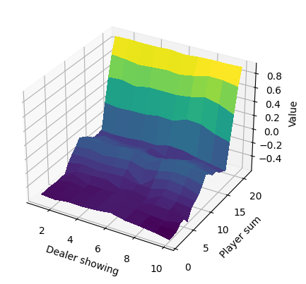
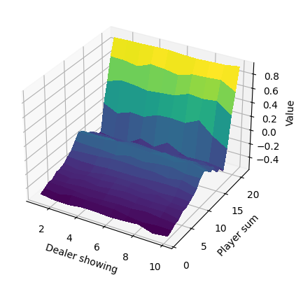
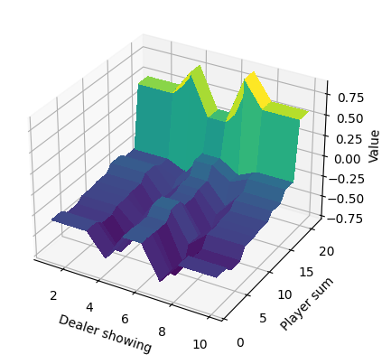
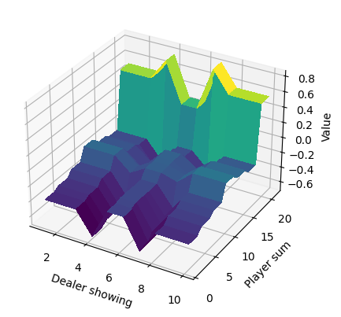

# rl
:brain: Implementation of various Reinforcement Learning algorithms

These are implementations of different Reinforcement Learning algorithms as described in Sutton and Barto's book _Reinforcement Learning: An Introduction, 2nd Edition_.

## Requirements

- Python 3.7+
- Install dependencies: `pip install -r requirements.txt`

## Easy21 Environment

All algorithms were implemented to solve a simplified version of Blackjack called _Easy21_. This environment was proposed by David Silver as part of the assignment of his [course](https://www.davidsilver.uk/teaching/). The rules of the game are as follows:

- The game is played with an infinite deck of cards (i.e. cards are sampled with replacement)
- Each draw from the deck results in a value between 1 and 10 (uniformly distributed) with a color of red (probability 1/3) or black (probability 2/3)
- There are no aces or picture (face) cards in this game
- At the start of the game both the player and the dealer draw one black card (fully observed)
- Each turn the player may either stick or hit
- If the player hits then they draw another card from the deck
- If the player sticks they receive no further cards
- The values of the player’s cards are added (black cards) or subtracted (red cards)
- If the player’s sum exceeds 21, or becomes less than 1, then they _goes bust_ and lose the game (reward -1)
- If the player sticks then the dealer starts taking turns. The dealer always sticks on any sum of 17 or greater, and hits otherwise. If the dealer goes bust, then the player wins; otherwise, the outcome - win (reward +1), lose (reward -1), or draw (reward 0) - is the player with the largest sum

## Algorithms

- Monte Carlo Methods (`mc.py`)
  - Monte Carlo with Exploring Starts
  - On-policy Monte Carlo
  - Off-policy Monte Carlo with weighted importance sampling
- Temporal Difference Methods (`td.py`)
  - On-policy Sarsa
  - Q-learning
- n-Step Bootstrapping Methods (`nstep.py`)
  - On-policy n-step Sarsa
  - Off-policy n-step Sarsa
  - n-step Tree Backup
- Planning Methods (`planning.py`)
  - Dyna-Q
  - Prioritized Sweeping
  - Monte Carlo Tree Search
- Function Approximation Methods (`approximation.py`)
  - On-policy Gradient Monte Carlo
  - Semi-gradient TD(0)
  - Semi-gradient n-step TD
  - On-policy semi-gradient Sarsa
  - On-policy semi-gradient n-step Sarsa
- Function Approximation with Eligibility Traces Methods (`eligibility_traces.py`)
  - Semi-gradient TD(lambda)
  - On-policy semi-gradient Sarsa(lambda)
- Policy Gradient Methods (`policy_gradient.py`)
  - REINFORCE with Baseline
  - One-step Actor-Critic
  - Actor-Critic with Eligibility Traces

## Results

Each algorithm computed the _optimal_ value function for the Easy21 environmen. The following figure shows plots of these value functions for each of the algorithms listed above (always starting from the left in each row). Each individual plot can be found inside the `output/` directory.

<p align="center">
  
  
  
  
  
  
  
  
  
  
  
  
  
  
  
  
  
  
  
  
  
</p>

### Reproducing Results

To reproduce these results, you can run each algorithm separately by executing its file with the appropriate parameters. For example, to reproduce the Q-learning plot you can run:

```
python td.py --qlearning --epochs 1000000 --alpha 0.005 --gamma 0.9 --verbose
```

To find out what parameters are needed you can type `python [FILE] -h`. For example, for TD methods you can run:

```
python td.py -h
```

## Issues

If you believe any of the implementations is wrong, or if you encounter any problems running the algorithms; let me know!
